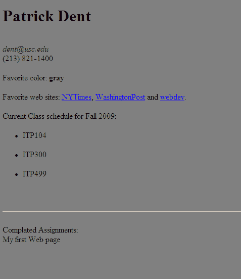

First Web Page
==============

This lab consists of two parts:

1. You will be creating your first web page that contains some personal information and uses most of the basic HTML tags you learned. This page will be saved on your local computer. You must save the page as classpage.html.
2. You will then use an FTP (file transfer protocol) program to check if your web space on the USC Student server is set up properly (and fix it if it is not), and then copy the web page you created up to a SPECIFIC folder in your USC web space.

And finally, you will want to view that web page in its new public location where all the world can see it (rather than viewing it on the hard drive of your local computer). A link from the course site with your name will be set up by the instructor.

The Web page you create should contain:

 * Your name, email address and possibly a contact phone number.
 * Your favorite color, <em>which should ALSO be the background color of the web page</em> (using the style="background-color: YOUR-COLOR-HERE" attribute on the body tag).
 * A list of your three favorite web sites including WORKING hyperlinks (i.e. by clicking on the names of the sites the viewer should be taken to those web site).
 * A list of the classes you are taking this semester, as well as a note as to what semester it is.
 * A line below all of the above personal information
 * A list of all assignments in the class... of course at this point the current "personal web page" will be your only completed assignment.

As with all of your web pages, your page should contain the basic HTML skeleton using the following tags: html, head, title and body.

Finally, you should use basic formatting tags such as strong and em to format your text, as well as heading tags such as h1 and h2 to make some text larger.

To complete this lab you need to :

* complete the above page AND name the file "classpage.html" (or renamed the file if you originally saved it under a different name)
* post it to your USC web space (inside the public_html folder) inside a directory named itp104 (all lower case)
* VERIFY that you can see/reach it through a web browser at the USC server location (i.e. not just viewing it from your hard drive)

By the beginning of the next class (see this lab's due date) you should be able to click on your name on the course site and reach the page you created and uploaded. 

<h2>Example</h2>

