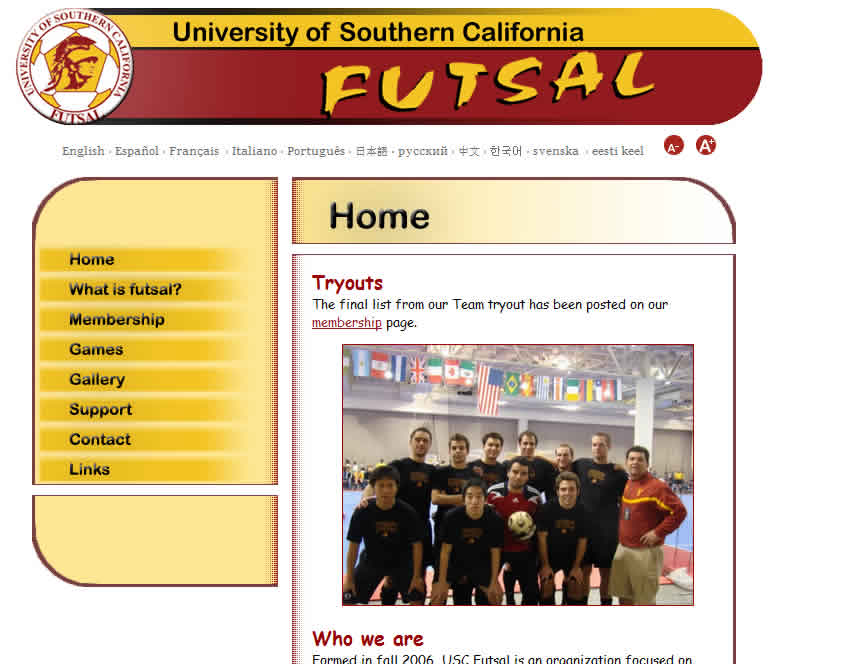

Final Project Homepage
================

Create a first draft of your final project homepage. I would highly recommend creating a new folder called "project" or similar and add all your final project files in this folder.  

**REQUIREMENTS:**

* __Major title graphic:__ Should include a main graphic (like a logo) you create to represent the topic/idea of your project. This graphic should be fairly large in size (not just a small button) and prominantly placed. 

* __Real content:__ Not just placeholder text. Of course you may change this text after the submission if needed. This is not a final draft yet.

* __Navigation:__ Navigation should reflect the site structure and organization of your project. Clicking on the navigation items does not have to go to a real page (although you can make some placeholder pages for now), but each navigation item __DOES__ have to be a link. 

* __General design:__ The page should have a fairly unified style, look, color scheme, etc. Your site might have a consistent 2 column layout and all pages would have this 2 column layout. In some websites, the home page may have a different layout than the rest of the site. This is a good time to think about which approach you'd want to take. In either approach, the general look, feel, color scheme, etc., should be laid out and consistent.

* __Theme:__ Make sure your graphic, navigation, and content all revolve around the central theme/topic of your final project.

**DELIVERY:**

My recommendation is to create a new folder inside your itp104 folder on the web server to keep all your final project files in one place. For example, if I call my folder "project," I can reach it by going to www-scf.usc.edu/~USERNAME/itp104/project. Upload your home page HTML and all graphics to that folder. Link that HTML file on your classpage, as usual.

**SAMPLES**

*Please note the examples below are FINAL fronts (what the students completed at the end of the semester) but they give you an idea of title and navigation graphics/buttons. Also note that most frontpages have introductory text for the site even though two of the examples below do not.*

